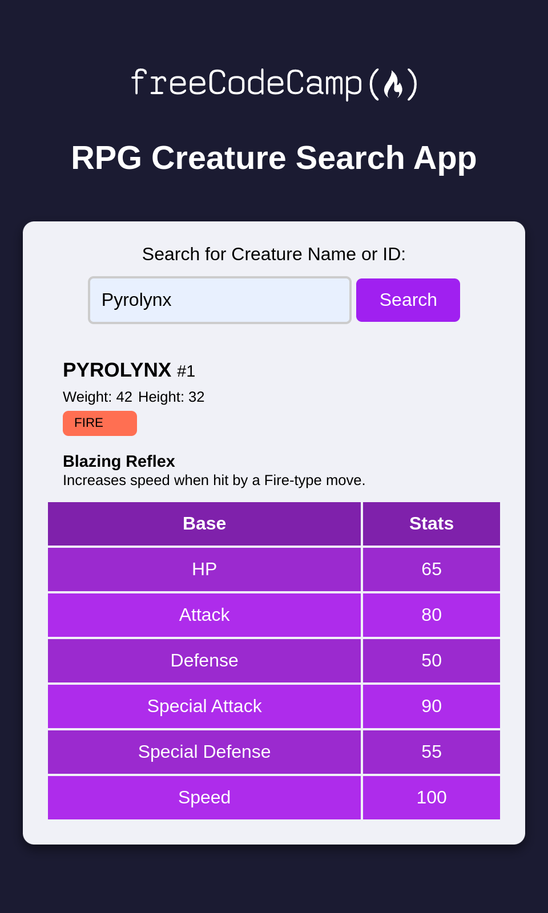

# 🐉 freeCodeCamp - RPG Creature Search App

This is a solution to the [RPG Creature Search App Certification Project on freeCodeCamp](https://www.freecodecamp.org/learn/javascript-algorithms-and-data-structures-v8/build-an-rpg-creature-search-app-project/build-an-rpg-creature-search-app).

---

## 🚀 Overview

### 🌐 [Live Project Preview on Vercel](https://xeezfcc-rpgcreaturesearchapp.vercel.app/)

### 📸 Screenshot

---

## 👨‍💻 Author

- **GitHub**: [justXeeZ](https://github.com/justXeeZ)
- **freeCodeCamp**: [@justXeeZ](https://www.freecodecamp.org/justXeeZ)

