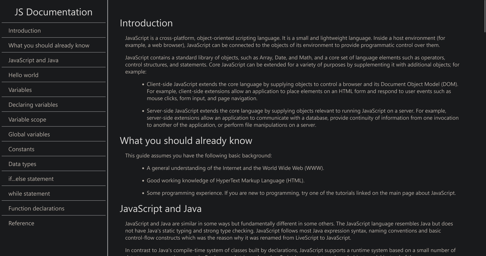
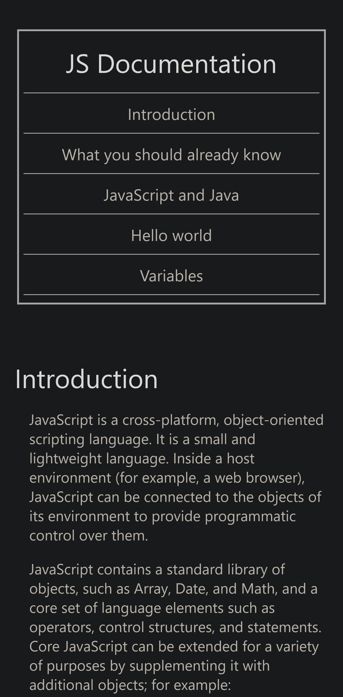

# 📚 freeCodeCamp - Technical Documentation Page

This is a solution to the [Technical Documentation Page Certification Project on freeCodeCamp](https://www.freecodecamp.org/learn/2022/responsive-web-design/build-a-technical-documentation-page-project/build-a-technical-documentation-page).

---

## 🚀 Overview

### 🌐 [Live Project Preview on Vercel](https://xeezfcc-technicaldocumentationpage.vercel.app/)

### 📸 Screenshots

#### Desktop Preview

#### Mobile Preview

---

## 👨‍💻 Author

- **GitHub**: [justXeeZ](https://github.com/justXeeZ)
- **freeCodeCamp**: [@justXeeZ](https://www.freecodecamp.org/justXeeZ)
