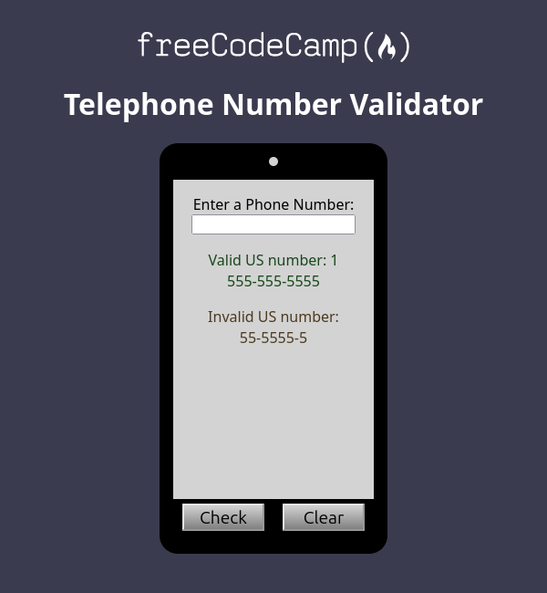

# ☎️ freeCodeCamp - Telephone Number Validator

This is a solution to the [Telephone Number Validator Certification Project on freeCodeCamp](https://www.freecodecamp.org/learn/javascript-algorithms-and-data-structures-v8/build-a-telephone-number-validator-project/build-a-telephone-number-validator).

---

## 🚀 Overview

### 🌐 [Live Project Preview on Vercel](https://xeezfcc-telephonenumbervalidator.vercel.app/)

### 📸 Screenshot

---

## 👨‍💻 Author

- **GitHub**: [justXeeZ](https://github.com/justXeeZ)
- **freeCodeCamp**: [@justXeeZ](https://www.freecodecamp.org/justXeeZ)
